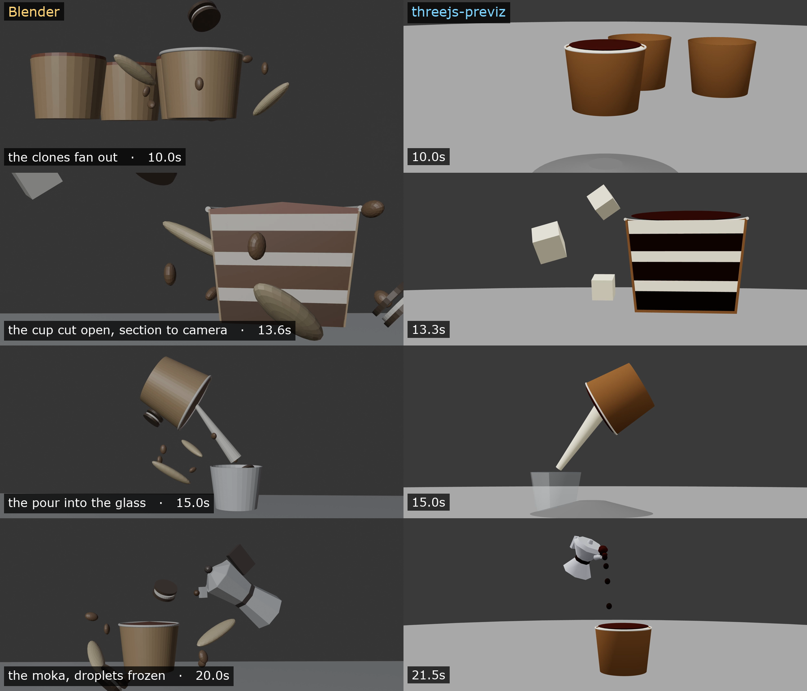

# threejs-previz

Cinematic previz in code: build a **blocking scene** in Three.js, move a camera
through it with **named cinematic moves**, prove the shots work by **measuring**
(not eyeballing), and render frame-deterministically with **Remotion**.

The output is a **motion reference** for a generative video model (Higgsfield,
Seedance, …): the model supplies texture and light; you keep control of staging,
timing and framing — exactly the things a model cannot invent consistently.

## Blender, and the same thing in code

The left column is a Blender blocking pass; the right is the same piece built
with this tool. Same four beats, read off both timelines at the same
timestamps: the clones fanning out, the vertical cross-section, the pour into
the glass, and the moka with its droplets frozen mid-air.

The difference is not what you see — it is that on the right, every shot was
measured before it rendered (is the hero in frame, is it *visible*, does the
camera clear the geometry, does the path jump, does the pour still reach the
glass), and the whole 30 seconds is one file you can diff.



▶ [`media/tiramisu-blender-reference.mp4`](media/tiramisu-blender-reference.mp4) — the Blender pass
▶ [`media/tiramisu.mp4`](media/tiramisu.mp4) — 13 cuts, 720 frames, 2520×1080, this tool

## The pieces in `media/`

Every one of these is a single scene file under `src/scenes/`, rendered end to
end and gated by the audits. Click to play.

| | what it is | what it exercises |
|---|---|---|
| ▶ [tiramisu](media/tiramisu.mp4) | a 9 cm kraft cup, 13 cuts, 30 s | two cutting systems on one prop — horizontal bands for the hook, a vertical halving for the close-up — plus the moka→cup→glass chain, measured by `attachments` |
| ▶ [orbital](media/orbital.mp4) | three worlds, one camera, no cuts | a dome orbit that ends at ground level, dips through the floor, swaps the world under an opaque surface and rises into the next |
| ▶ [floors](media/floors.mp4) | three takes, one rising move | a move that is bit-identical across the three takes, a hero derived from the integral of the speed profile, and floor slabs whose dark flash is geometry |
| ▶ [canspot](media/canspot.mp4) | a soda can, 13 cuts | CSG slices, clone choreography emerging from inside the hero, object animation as a pure function of the frame |
| ▶ [roundtable](media/roundtable.mp4) | six characters, four cuts | identity colour as a cast list — the gaze hands off face to face, three over-the-shoulder cuts, real handheld |

## Quick start

```bash
pnpm install
pnpm audit:scenes  # the gate: eight checks per shot, headless, ~150 ms for 900 frames
pnpm render        # audit && render the 30 s roundtable scene to out/
pnpm studio        # scrub the timeline in Remotion Studio (the shot's view)
pnpm inspect       # the inspector: orbit the scene, see the camera's path
```

`studio` shows you what the shot sees. `inspect` shows you the shot itself —
free orbit, the camera's whole trajectory drawn as a line coloured per shot
with a marker at every cut, the shot camera as a moving frustum, and green
boxes on whatever the current shot declared as its `hero`. Toggle to
"shot camera" to see the exact render, back to "free orbit" to understand
it. It reuses `def.make()`, `def.pose()` and `applyFrame` — the same pure
functions Remotion renders, so there is no second implementation to drift.

The right-hand panel holds the knobs each scene **declares** — the dome's
apex, the speed at the midpoint of a rise, how far the clones fan out. Turning
one rebuilds the scene through the same `def.make()` the renderer calls and
redraws the camera path, so what you are looking at is always a scene that
could be rendered as it stands. Then "copy render command" gives you the audit
**and** the render, joined by `&&`, carrying the values you found:

```bash
pnpm exec node lib/auditScenes.mjs src/scenes/orbital.js --params='{"apex":68}' \
  && pnpm exec remotion render orbital out/orbital.mp4 --props='{"params":{"apex":68}}'
```

The audit rides along on purpose: if tuned values could reach a render without
passing back through the gate, every check in this repo would only ever have
run against the defaults. The camera itself stays read-only — nothing here can
drag a camera into a pose, because the moment a camera is placed by eye instead
of by a move, the pipeline has lost what it is for.

**Save writes back to the scene file** and runs the gate on what it wrote. That
matters more than the convenience: the workflow this is built for is a
conversation, not a session — you ask for a scene, dislike something, change
it, and say *"carry on from what I changed."* That last step only works if the
change is in the repo, because a value in a browser tab is invisible to git, to
whoever you hand the project to, and to an agent you ask to continue. The repo
is the handoff. It goes the other way too: edit a scene by hand and the
inspector drops any knob whose default moved — the file wins.

Tuning is held **per scene across the dropdown**, so you can settle three
scenes and take the whole edit out in one command; the panel lists every film
the current scene belongs to. See [docs/parameters.md](docs/parameters.md).

`pnpm render` refuses to start if any audit fails. That is the point: a
failed shot costs milliseconds to find, not a render measured in minutes.

## Layout

```
├── lib/                     the runtime — one copy of each module
│   ├── cameraMoves.js       the PATH:     move(u) -> {position,target,fov,roll}
│   ├── blocking.js          the SCENE:    identity, groups, CSG, the 3 audits
│   ├── geometry.js          the SHAPES:   every shape, no exceptions
│   ├── shots.js             the TIMELINE: frame -> shot -> u -> camera
│   ├── scene.js             the DEFINITION: defineScene — plain JS, Node loads it
│   ├── params.js            the KNOBS:      declared, ranged, resolved once
│   ├── remotion.jsx         the COMPONENT:  sceneComposition -> <Composition>
│   ├── film.js              the EDIT:       defineFilm — plain JS, Node loads it
│   ├── film.jsx             the EDIT's COMPONENT: filmComposition (live/stitch)
│   ├── inspector.jsx        the VIEWER:     orbit the scene, draw the path
│   └── auditScenes.mjs      the GATE:       exits non-zero if a shot fails
├── src/
│   ├── index.jsx            registerRoot
│   ├── Root.jsx             one <Composition> per scene, all metadata derived
│   └── scenes/
│       ├── roundtable.js    6 characters, 4 cuts, target handoffs, handheld
│       ├── canspot.js       13-cut product piece: CSG slices, clone
│       │                    choreography, object animation, 16 audited entries
│       └── demo.js          the smallest complete scene (2 characters, 2 shots)
├── inspector/               the Vite app behind `pnpm inspect`
│   └── writeback.js         save knob values into the scene file, then audit
├── docs/                    the method, written up
└── skills/                  the same material packaged as Claude skills
```

A scene file imports from `scene.js` and **never** from `remotion.jsx` — that
keeps it loadable by plain Node, which is what lets the audit gate check the
real scene rather than a stub.

## The rules that carry the pipeline

- **Colour is identity, not decoration.** The palette is the cast list: once
  six characters are red/green/blue/yellow/purple/cyan, *"cyan over blue's
  shoulder"* is an unambiguous stage direction — to you and to the model.
- **The shot list is the single source of truth.** `durationInFrames` is
  derived from it; restating it lets an extended shot silently truncate the
  render.
- **Shot ranges are half-open.** `[0, 360)` owns frames 0–359; frame 360
  belongs to the next shot. Cuts are hard by construction — camera, target and
  lens change *on* the cut, never across it.
- **Pure function of the frame.** No clocks, no `useFrame`, no
  `Math.random()` (there is a seeded `rng`). Remotion renders frames out of
  order across workers; anything with its own state flickers.
- **Measure, don't eyeball.** Eight checks per shot, all headless:
  1. **Collisions** — triangle-exact via BVH, on subjects.
  2. **Framing** — the shot's `hero` projected to NDC; is it inside the frame?
  3. **Floor** — nothing sinks through the ground plane.
  4. **Occlusion** — sightline raycasts from the camera to the hero: being in
     frame is not the same as being *visible*. "Nobody blocks cyan at the
     end" is a measurement, not a hope. Translucent materials don't block.
  5. **Camera clearance** — exact BVH distance from the camera to everything
     visible; closer than the near plane clips a hole through geometry.
  6. **Continuity** — a full-frame-rate sweep: nothing pops into or out of
     existence *on screen*, nothing teleports. Entering from off-screen,
     emerging from behind something, sinking into water, and same-place swaps
     (a can replaced by its CSG slices) are automatically legitimate.
  7. **Attachments** — declared connections, measured: "the pour hangs from
     the cup's mouth", "the last droplet sits on the lip". Author them from
     `ctx.anchor(name, localPoint)` (world positions through the scene graph,
     never typed trigonometry), then declare them in `attachments:` and the
     audit reports pair, distance and frame when a chain disconnects.
  8. **Camera path** — position step, view turn AND roll against the shot's
     own median: a discontinuous path reads exactly like passing through an
     object, and a gaze along the camera's own up axis spins the frame while
     position and direction stay smooth.

  Every shot declares its `hero` — what must stay in frame. `hero: []` marks a
  transitional shot: framing and occlusion waived, everything else still runs.
- **Audit subjects, not scenery — and declare intent, don't silence checks.**
  `ENV` is excluded from collisions; everything intentional is declared with
  wildcards, per class: contact `ignore: [['PRP_chair_*', 'CHR_*']]`, floor
  breaches `floorIgnore: ['PRP_ball']`, intentional blockers per shot
  `occlusion: { ignore: ['PRP_ice_*'] }` (or `occlusion: false`), sanctioned
  pops per shot `pops: ['PRP_debris_*']`, camera margin `clearance: 0.05`.
- **The timeline has no gaps.** `shotList` throws if a frame has no owner —
  an editorial gap is declared as an explicit placeholder shot.
- **Everything is scoped to a context.** `createBlocking()` returns `ctx` with
  its own scene, groups, camera and palette — no module state, so the gate, a
  film, or a Remotion worker can build many scenes in one process.
- **Build once per worker, move only the camera — and the poses.** `def.make()`
  runs in a `useMemo`; CSG and BVH are build-time work. Objects that move do it
  through `defineScene({ animate })` — a pure function `({ ctx, frame }) => …`
  that poses everything from scratch each frame. `def.pose(ctx, frame)` is the
  single resolver the gate, the renderer and the inspector all share, so the
  three cannot drift apart.
- **Declare a hero per shot; `hero: []` marks a transitional entry.** A can
  erupting through the bottom of frame, a close travel along a product, a
  fly-through — nothing whole stays in frame there *by design*. Framing is
  waived for that entry; collisions and floor still run.

## A scene, end to end

```js
// src/scenes/myscene.js — plain JS, Node can load it
import { defineScene } from '../../lib/scene.js';
import { moves, retarget, handheld } from '../../lib/cameraMoves.js';

export default defineScene({
  id: 'myscene',
  fps: 24, height: 720, aspect: 21 / 9, subjectSize: 2.5,
  identity: { grey: '#9a9a9a', wood: '#8a6136', green: '#27ae60' },
  ignore: [['PRP_chair_*', 'CHR_*']],

  // The knobs this scene opens, with the range it is still itself inside.
  // They reach build/animate/shots as `p`, resolved once at build time.
  params: {
    tableRadius: { value: 0.7, min: 0.45, max: 1.1, step: 0.02, unit: 'm' },
    orbit: { value: 4, min: 2.5, max: 6, step: 0.1, unit: 'm' },
  },

  build: ({ ctx, geo, p }) => {
    ctx.part('ENV_floor', geo.disc({ radius: 6 }), 'grey', ctx.groups.ENV);
    ctx.part('PRP_table', geo.table({ radius: p.tableRadius }), 'wood');
  },
  shots: (p) => [
    { name: 'SC01', from: 0, to: 240, focalLength: 28, easing: 'easeInOutSine',
      hero: 'PRP_table',
      move: moves.turntable({ radius: p.orbit, pushIn: 0.95, target: [0, 0, 0] }) },
  ],
});
```

Register it in `src/Root.jsx`, and it is auditable (`pnpm audit:scenes`), scrubbable
(`pnpm studio`), tunable (`pnpm inspect`) and renderable
(`remotion render myscene out/myscene.mp4`) with nothing restated anywhere.
`params` is optional — a scene with no knobs keeps `build: ({ ctx, geo })` and
a plain `shots` array, exactly as before.

## The roundtable scene as a worked case study

`src/scenes/roundtable.js` was built the way the pipeline is meant to be used —
in stages, one commit per stage as the backup, each stage audited before the
next was layered on. The git history *is* the case study:

1. **Blocking.** Six seated proxies with identity colours, table, chairs, floor
   and round wall. Static top/side/wide views as the stage check. The audit
   caught the intra-figure contacts, which were then *declared* per character —
   so a red×green collision still counts.
2. **Camera.** Four hard cuts; the orbit's gaze hands off face to face
   (`retarget`), the OTS cuts barely crawl (`truck`). Two real findings, fixed
   by measuring: the orbit cut the table's pedestal out of frame (the hero was
   the *whole* table; the honest statement is "the tabletop always in frame",
   so the top became its own part), and the low-shoulder cut 4 swung its near
   mass out of frame — the camera now rides the cyan→green line above green's
   head, worked out against stills.
3. **Handheld.** Body sway in long waves + a millimetre tremor on the camera,
   drift + breathing on the target (`drift`) — livelier in the orbit, lazy in
   the dialogue. Cut 4's three shot entries play **slices of one move**
   (`slice`) so the noise never restarts: boundary deltas measure the same as
   any mid-shot frame.

## Output for a video model

- **Frame-exactness beats bitrate** — `pnpm frames` renders a PNG sequence.
- **Keep the aspect the model expects**; letterboxing teaches it the letterbox.
- **Keep the flat identity colours.** They are the reference's semantics.
- **Render at the target resolution** — bump `height` in the scene definition.

## Verified

Rendered end to end on `remotion@4.x` + `@remotion/three` + `@react-three/fiber@8`
+ `three@0.185`: the 30 s / 720-frame roundtable scene to mp4 (24 fps, 21:9),
stills, and the audit gate loading the real scene files in Node (~30 ms for
900 frames across two scenes). Notes from first contact, so you don't rediscover
them:

- Remotion requires a `tsconfig.json` even in an all-JS project.
- The audits call `updateWorldMatrix(true, false)` — ancestors included —
  because in headless Node nothing else ever computes a rig pivot's world
  matrix. Plain `updateMatrixWorld(true)` measured every rigged mesh at the
  origin.
- **R3F's `<primitive>` reparents what it mounts.** `<PrevizStage>` used to
  mount the five groups one primitive each, which silently emptied `ctx.scene`
  in the browser — every `ctx.get()` after mount searched a hollow scene, while
  the Node-side audit (no R3F) kept passing. It now mounts `ctx.scene` whole.
  If you write a custom stage, mount the scene, never the groups.
- `Config.setChromiumOpenGlRenderer('angle')` is set in `remotion.config.ts`;
  without it some machines render black.
- Parameters are verified through the whole chain: two `remotion still` renders
  of the same frame, one with `--props`, differ; an out-of-range or unknown key
  fails the render with the declared range named, not silently clamped. Watch
  which frame you compare — the first pair I rendered were byte-identical
  because frame 320 is exactly where the tiramisu's sweep passes through zero,
  so neither knob could show.
- Films are verified in **both modes**: `pnpm render:film` (live — two
  `<ThreeCanvas>` scenes through a real TransitionSeries dissolve) and
  `pnpm render:film:stitch` (scenes pre-rendered to `public/`, stitched via
  `<OffthreadVideo>`); the two dissolve frames match pixel for pixel. The film
  definition lives in plain-JS `film.js` so the gate audits the real file, and
  `filmComposition` throws if transitions are declared without injecting
  `TransitionSeries`/`linearTiming`. Composition ids allow no underscores.
